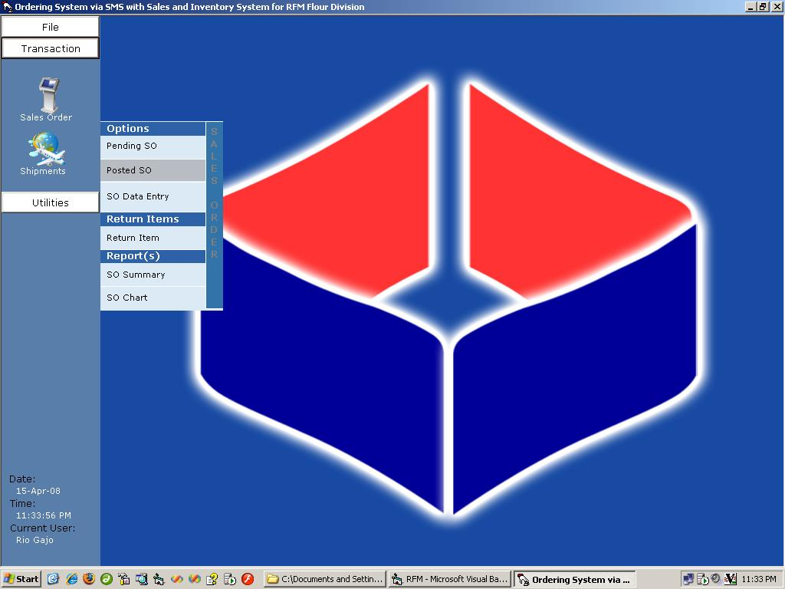



## An Inventory System with per user access, reports, charting etc

### Description

An Inventory System with per user access, reports, charting etc.

This is a part of a system that accepts order thru phone, SMS and online. I removed the SMS and online part, hence the system title Ordering thru SMS....

This system has a per user access module which restricts or give access to user base on their login type.

Also shows how to use the graph control in VB6.

Uses SQL server 200 (or up) for the back end, MS Access 2000 - 2003 for reporting.

Make sure to attach the mdf file to your server and refresh the linked tables in MS-Access to enable reports.

Kindly email me your questions at riogajo@riogajo.com

Display will look best on 1024x768 resolution
 
### More Info
 
There are currently 3 users that can log in the system, the password is the same as the logon name.

rio

arvi

jucelle

Display will look best on 1024x768 resolution

             |
---                |---
**Submitted On**   |2007-07-28 19:15:04
**By**             |[rioshox](https://github.com/Planet-Source-Code/PSCIndex/blob/master/ByAuthor/rioshox.md)
**Level**          |Intermediate
**User Rating**    |5.0 (25 globes from 5 users)
**Compatibility**  |VB 6\.0, VBA MS Access
**Category**       |[Complete Applications](https://github.com/Planet-Source-Code/PSCIndex/blob/master/ByCategory/complete-applications__1-27.md)
**World**          |[Visual Basic](https://github.com/Planet-Source-Code/PSCIndex/blob/master/ByWorld/visual-basic.md)
**Archive File**   |[An\_Invento2109654152008\.zip](https://github.com/Planet-Source-Code/rioshox-an-inventory-system-with-per-user-access-reports-charting-etc__1-70419/archive/master.zip)

